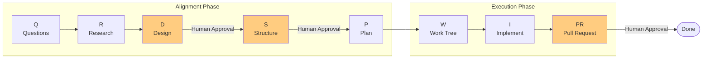

# QRSPI Agent — Structured Programming Agent Workflow

> **"We got AI programming all wrong."** — Dex Horthy

A practical implementation from RPI (Research-Plan-Implement) to QRSPI/CRISPY.

Original article: [From RPI to QRSPI: Rebuilding the First Structured Programming Agent Workflow](https://xiezhixin.com/2026-04-20-rpi-to-crispy/)

📖 [中文文档](./docs/README.zh.md)

---

## Why This Tool Is Needed

In 2025, engineers using programming agents all hit the same wall: prompt the agent, get code that looks reasonable, discover it can't integrate with the existing codebase, then spend more time fixing it than writing it by hand.

RPI solved part of the problem, but exposed three hidden failure modes at scale:

| Failure Mode | Symptom | QRSPI Solution |
|---------|------|----------------|
| **Instruction Budget** | Prompt bloats to 85+ instructions, model silently skips key steps | 8-13 instructions per stage, far below the 150-instruction danger line |
| **Magic Word Trap** | Specific phrases needed to trigger correct behavior | Default behavior is correct behavior, no secret handshakes required |
| **Plan-Reading Hallucination** | Plan reads reasonably, but technical assumptions are wrong | Validation goes deeper than "reads reasonably" |

---

## 8-Stage Workflow



### Alignment Phase — Get Full Alignment Before Writing a Single Line of Code

```
Q → R → D → S → P
```

| Stage | Name | Core Output | Human Involvement |
|------|------|---------|---------|
| **Q** | Questions | 5-15 specific technical questions | High — generated from feature ticket |
| **R** | Research | Technical map (code fact record) | Medium — review findings |
| **D** | Design Discussion | ~200-line markdown design doc | **Highest** — brain surgery stage |
| **S** | Structure Outline | Function signatures + type definitions + vertical slices | High — confirm interfaces |
| **P** | Plan | Tactical implementation document | Low — spot-check only |

### Execution Phase

```
Work Tree → I → PR
```

| Stage | Name | Core Output | Key Principle |
|------|------|---------|---------|
| **W** | Work Tree | Vertical slice task tree | Mock API → Frontend → Database |
| **I** | Implement | Working code | Each slice is an independent session |
| **PR** | Pull Request | Structured PR description | Human must read and own the code |

---

## Quick Start

### Installation

```bash
git clone <repository>
cd qrspi-agent
npm install
cd packages/qrspi && npm run build
```

CLI entrypoint:

```bash
# Use directly via npx
npx @qrspi/node --help

# Or after local build
node packages/qrspi/dist/cli/main.js --help
```

### Built-in Skill

This repository includes a local skill:

- `skills/qrspi-cli-workflow`

It is a utility skill that guides agents to prefer calling the project's `qrspi` CLI rather than manually simulating the workflow. Suitable for initializing features, checking status, rendering stage prompts, advancing stages, approving gates, managing slices, and driving automated execution via `run`.

### 1. Initialize Workflow

```bash
cd your-project
qrspi init user-authentication --root .
```

Output:
```
✅ QRSPI workflow initialized
   Feature: user-authentication
   Project: /path/to/your-project
   Output:  /path/to/your-project/.qrspi/user-authentication

   Current stage: Q - Questions

   Next step: qrspi prompt Q --render
```

### 2. Get Stage Prompt

```bash
# View Q stage instructions and validation criteria
qrspi prompt Q

# Render full prompt (ready to use with Claude Code / Codex CLI)
qrspi prompt Q --render --input "Add user authentication with email+password and OAuth"
```

### 3. Save Artifact and Advance

Save the agent's output to `.qrspi/<feature>/artifacts/Q_<date>.md`, then:

```bash
qrspi advance
```

### 3b. Auto-Execute Until Human Gate

If you have Claude Code or Codex CLI configured, you can let the workflow auto-advance:

```bash
# Use real Claude Code, starting from current stage
# Default model: kimi-for-coding
qrspi run --input "Add user authentication with email+password and OAuth"

# Use Codex CLI, starting from current stage
# Default model: gpt-5.4
qrspi run --runner codex --input "Add user authentication with email+password and OAuth"

# If concerned about Claude hanging, set timeout (seconds)
qrspi run --input "Add user authentication" --timeout 180

# Or explicitly specify model
qrspi run --input "Add user authentication" --model kimi-for-coding

# Use mock runner for local state-machine validation
qrspi run --runner mock --input "Add user authentication"

# Continue after D / S / PR stage confirmation
qrspi approve
```

### 4. List Workflows

```bash
qrspi list
```

Output:
```
============================================================
QRSPI Workflows
============================================================
  ✓ auth: PR (completed)
  ⏸ login-ui: D (waiting_approval)
  ○ payment: Q (ready)
============================================================
```

### 5. Check Status

```bash
qrspi status
```

Output:
```
============================================================
QRSPI Workflow Status
============================================================
>>>    Q: Questions [Alignment]
       R: Research [Alignment]
       D: Design Discussion [Alignment]
       S: Structure Outline [Alignment]
       P: Plan [Alignment]
       W: Work Tree [Execution]
       I: Implement [Execution]
       PR: Pull Request [Execution]
============================================================
```

---

## Core Principles in Practice

### 1. Context Window Management (40% Rule)

```bash
# View current context strategy
qrspi context

# View instruction budget report
qrspi budget
```

**Rules:**
- Keep context utilization **below 40%**
- Force session switch at **60%**
- Progress is persisted to disk; new sessions load only what's needed for the current stage

### 2. Vertical Slices (Better Than Horizontal Layers)

```bash
# Add vertical slices
qrspi slice --add "mock-api" --desc "Create Mock API endpoints" --order 1 --checkpoint "curl test passes"
qrspi slice --add "frontend-ui" --desc "Implement login UI" --order 2 --checkpoint "Page is interactive"
qrspi slice --add "database" --desc "Add user table and migration" --order 3 --checkpoint "Unit tests pass"

# List slices
qrspi slice --list
```

**Why vertical slices are better:**
- Each slice has a testable checkpoint
- Avoid deferring all integration to the end
- Each slice can be a fresh session with clean context

### 3. Automated Closed Loop

The current version already supports a basic automation chain:

- `qrspi run`: auto-execute current stage
- Stage outputs are automatically persisted to `artifacts/`
- Stage results are automatically validated by the validator
- Artifacts are automatically parsed into structured data saved to `structured/`
- `D`, `S`, `PR` stages automatically pause for human confirmation
- `qrspi approve`: advance to next stage after human confirmation

### 4. Runner and Model Configuration

Three runners are currently supported:

- `claude`
- `codex`
- `mock`

Model selection supports three levels of priority:

1. Command-line argument `--model`
2. Environment variable `QRSPI_<RUNNER>_MODEL` or `QRSPI_MODEL`
3. Runner default

Default models:

- `claude` -> `kimi-for-coding`
- `codex` -> `gpt-5.4`

### Language Configuration

QRSPI supports bilingual prompts (English and Chinese). Default is English.

```bash
# Use Chinese prompts and CLI output
qrspi run --input "Add user authentication" --lang zh

# Or rely on system LANG (e.g. zh_CN.UTF-8 -> Chinese, en_US.UTF-8 -> English)
export LANG=zh_CN.UTF-8
qrspi run --input "Add user authentication"
```

Example:

```bash
export QRSPI_RUNNER=codex
export QRSPI_CODEX_MODEL=gpt-5.4-mini
qrspi status
```

---

## Stage Prompt Templates

Each stage's prompt design follows the **instruction budget principle** (8-13 instructions):

### Q - Questions

**Instructions (7):**
1. Analyze the given feature ticket or requirement description
2. Identify all technical information needed to implement the feature
3. Produce 5-15 specific, researchable technical questions
4. Each question must point to a specific aspect of the codebase
5. Questions must be specific enough to answer via code search
6. Do not include any implementation suggestions or solutions
7. Sort by dependency: infrastructure questions first, dependent questions later

**Validation Criteria:**
- Question count is between 5-15
- Each question has a clear search direction
- No implementation suggestions mixed in
- No more than 3 blocking questions

### R - Research

**Key Design:** Hide original feature ticket, collect only facts

**Instructions:**
- Research the codebase based on the technical question list
- Produce an objective technical map (not a plan, not suggestions)
- Reference specific file paths, function names, and code snippets
- Do not form opinions on "how to modify"

### D - Design Discussion

**This is the highest-leverage stage in the entire flow.**

Output ~200 lines of markdown covering:
- Current state
- Desired end state
- Design decisions (at least 2 alternatives each)
- Architecture constraints
- Risks and mitigations

### S - Structure Outline

Analogous to C header files:
- Function signatures (no implementation)
- Type definitions
- Vertical slice divisions
- Dependency graph

### P - Plan

A plan constrained by Design and Structure:
- File-level change checklist
- Risk level for each change
- Executable test strategy
- Rollback checkpoints

---

## Project Structure

```
qrspi-agent/
├── packages/
│   └── qrspi/                  # Node.js/TypeScript core package
│       ├── src/
│       │   ├── cli/              # CLI entrypoint and command handling
│       │   ├── context/          # Context assembler (build minimal context per stage)
│       │   ├── engine/           # Automated workflow engine
│       │   ├── parsers/          # Stage artifact structured parser
│       │   ├── prompts/          # Prompt template system (instruction budget control)
│       │   ├── runner/           # CLI runner (claude / codex / mock)
│       │   ├── storage/          # File persistence and path resolution
│       │   ├── validators/       # Stage artifact heuristic validator
│       │   ├── workflow/         # Type definitions and stage schemes
│       │   └── index.ts          # Public API exports
│       ├── tests/                # Vitest test suite
│       ├── dist/                 # TypeScript compilation output
│       ├── package.json          # npm package config
│       ├── tsconfig.json         # TypeScript config
│       └── vitest.config.ts      # Test config
├── skills/
│   └── qrspi-cli-workflow/     # Local skill guiding agents to prefer qrspi CLI
├── docs/
│   ├── AUTOMATION_ENGINE_GAP_ANALYSIS.md
│   └── EXAMPLE.md
├── package.json                # Root workspace config
├── README.md                   # Human-facing user documentation
└── AGENTS.md                   # AI Coding Agent project guide
```

---

## Three Core Insights

### Insight One: Keep Context Window Utilization Below 40%

> At 60%, start a new session. This is independent of how large the context window is.

**Practice:** Save progress after each vertical slice, start a new session that loads only what's currently needed.

### Insight Two: Vertical Slices Beat Horizontal Layers

> Mock API → Frontend → Database, with a checkpoint after each slice.

**Practice:** Instead of "finish all database work first, then all API work", each slice has an end-to-end testable path.

### Insight Three: Sub-Agents as Context Firewalls

> Expensive models for orchestration and decision-making. Cheaper, faster models for scoped subtasks.

**Practice:** Orchestrator stays lean, sub-agents isolate context, coordinate through filesystem artifacts.

---

## Evolution Signals from RPI to QRSPI

> The differentiator in AI-assisted development is shifting from which model you use to how you configure and constrain the agent.

Variables that determine whether an agent produces reliable output or code that looks reasonable but silently breaks:

- Context management
- Instruction budget
- Sub-agent architecture
- Deterministic hooks
- Validation pipeline

**The model is the engine. The harness is what makes it work.**

---

## Acknowledgments

Inspired by:

- **[obra/superpowers](https://github.com/obra/superpowers)** — Subagent-driven development skill and the "Do Not Trust the Report" review philosophy
- **[humanlayer](https://github.com/humanlayer)** — Human-in-the-loop orchestration for AI agents

## License

MIT
