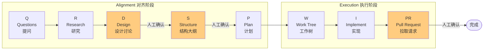

[English](../README.md) | 中文

# QRSPI Agent — 结构化编程 Agent 工作流

> **「我们把 AI 编程的一切都想错了。」** — Dex Horthy

从 RPI (Research-Plan-Implement) 到 QRSPI/CRISPY 的可落地方案实现。

文章原文: [从 RPI 到 QRSPI：重建第一个编程 Agent 结构化工作流](https://xiezhixin.com/2026-04-20-rpi-to-crispy/)

---

## 为什么需要这个工具

2025 年，工程师们用编程 Agent 时都在撞同一堵墙：给 Agent 提示，得到看起来合理的代码，发现无法与现有代码库集成，然后花比手写更多的时间去修复。

RPI 解决了部分问题，但在大规模使用时暴露了三个隐蔽的失败模式：

| 失败模式 | 表现 | QRSPI 的解决方案 |
|---------|------|----------------|
| **指令预算** | Prompt 膨胀到 85+ 条指令，模型静默跳过关键步骤 | 每个阶段 8-13 条指令，远低于 150 条警戒线 |
| **魔法词陷阱** | 需要特定短语才能触发正确行为 | 默认行为就是正确行为，无需秘密握手 |
| **计划阅读幻觉** | 计划读起来合理，技术假设却是错的 | 验证机制比"读起来合理"更深入 |

---

## 8 阶段工作流



### Alignment（对齐阶段）— 在写一行代码之前先把对齐做充分

```
Q → R → D → S → P
```

| 阶段 | 名称 | 核心产出 | 人工参与 |
|------|------|---------|---------|
| **Q** | Questions (提问) | 5-15 个具体技术问题 | 高 - 基于 feature ticket 生成 |
| **R** | Research (研究) | 技术地图（代码事实记录） | 中 - review 发现 |
| **D** | Design Discussion (设计讨论) | ~200 行 markdown 设计文档 | **最高** - 脑外科手术阶段 |
| **S** | Structure Outline (结构大纲) | 函数签名 + 类型定义 + 垂直切片 | 高 - 确认接口 |
| **P** | Plan (计划) | 战术实施文档 | 低 - 抽查即可 |

### Execution（执行阶段）

```
Work Tree → I → PR
```

| 阶段 | 名称 | 核心产出 | 关键原则 |
|------|------|---------|---------|
| **W** | Work Tree (工作树) | 垂直切片任务树 | Mock API → 前端 → 数据库 |
| **I** | Implement (实现) | 可工作的代码 | 每个切片独立 Session |
| **PR** | Pull Request (拉取请求) | 结构化 PR 描述 | 人工必须阅读并拥有代码 |

---

## 快速开始

### 安装

```bash
# 安装 CLI
npm install -g qrspi-agent
qrspi --help
```

可选：如果你的 Agent 环境支持 `skills add`，再安装本仓库附带的本地 skill。

```bash
npx skills add https://github.com/nixihz/qrspi-agent.git --skill qrspi-cli-workflow
```

### 内置 Skill

仓库附带一个本地 skill：

- `skills/qrspi-cli-workflow`

用于引导 agent 优先使用 `qrspi` CLI，而不是手工模拟工作流（init、状态、prompt、gate、切片、`run` 等）。

安装 skill 不等于安装 `qrspi` CLI。如果本机还没有 `qrspi` 命令，需要先安装 npm 包，或者改用 `npx qrspi-agent`。

### 1. 初始化工作流

```bash
cd your-project
qrspi init user-authentication --root .
```

示例输出:
```
[QRSPI] Initialized workflow: user-authentication
[QRSPI] Current stage: Questions
```

如果同一个项目的 `.qrspi/` 下有多个工作流，带状态的命令需要显式指定 feature：

```bash
qrspi status --feature user-authentication
qrspi stage --feature user-authentication
qrspi run --feature user-authentication --runner mock --max-stages 1
```

### 2. 获取阶段 Prompt

```bash
# 查看 Q 阶段的指令和验证标准
qrspi prompt render Q --feature user-authentication

# 渲染完整 prompt（可以直接给 Claude Code / Codex CLI 使用）
qrspi prompt render Q --feature user-authentication --input "添加用户认证功能，支持邮箱+密码和 OAuth"

# 导出基础 Prompt 模板供审阅，不包含当前 workflow 的上下文或用户输入
qrspi prompt export --lang zh --out qrspi-prompts.md
qrspi prompt export Q --lang zh --out Q_prompt.md
qrspi prompt export --lang zh --split --out qrspi-prompts/
```

### 3. 保存产物并推进

将 Agent 的输出保存到 `.qrspi/<feature>/artifacts/Q_<date>.md`，然后：

```bash
qrspi advance
```

### 3b. 自动执行直到人工 Gate

如果你已经配置好 Claude Code 或 Codex CLI，也可以让工作流自动推进：

```bash
# 使用真实 Claude Code，从当前阶段开始执行
# 默认模型: kimi-for-coding
qrspi run --input "添加用户认证功能，支持邮箱+密码和 OAuth"

# 使用 Codex CLI，从当前阶段开始执行
# 默认模型: gpt-5.4
qrspi run --runner codex --input "添加用户认证功能，支持邮箱+密码和 OAuth"

# 真实 runner 的长任务默认不设置超时。
# 可以在当前 run 目录中查看实时输出：
# .qrspi/<feature_id>/runs/<STAGE>_<timestamp>_attempt<N>/live_stdout.txt
# .qrspi/<feature_id>/runs/<STAGE>_<timestamp>_attempt<N>/live_stderr.txt

# 也可以显式指定模型
qrspi run --input "添加用户认证功能" --model kimi-for-coding

# 本地验证状态机时可使用 mock runner
qrspi run --runner mock --input "添加用户认证功能"

# D / S / PR 阶段确认后继续
qrspi approve

# 拒绝当前 gate 阶段，并准备重新生成
qrspi reject --comment "设计缺少迁移路径"

# 当上游假设变化时，回退到更早阶段
qrspi rewind R --reason "需要重新确认现有认证中间件"
```

### 4. 列出工作流

```bash
qrspi list
```

输出:
```
============================================================
QRSPI Workflows
============================================================
  ✓ auth: PR (completed)
  ⏸ login-ui: D (waiting_approval)
  ○ payment: Q (ready)
============================================================
```

### 5. 查看状态

```bash
qrspi status

# 存在多个工作流时
qrspi status --feature user-authentication
```

示例输出:
```
[QRSPI] Workflow: Questions (Feature: user-authentication)

============================================================
QRSPI Workflow Status
============================================================
>>>   Q: Questions [Alignment]
      R: Research [Alignment]
      D: Design Discussion [Alignment]
      S: Structure Outline [Alignment]
      P: Plan [Alignment]
      W: Work Tree [Execution]
      I: Implement [Execution]
      PR: Pull Request [Execution]
============================================================
[QRSPI] Workflow: Questions (Feature: user-authentication)

Engine Status: ready
Runner: claude
Model: kimi-for-coding
```

---

## 核心原则的实践

### 1. Context Window 管理（40% 规则）

```bash
# 查看当前 Context 策略
qrspi context

# 查看指令预算报告
qrspi budget
```

**规则:**
- Context 利用率保持在 **40% 以下**
- 达到 **60%** 时强制切换 Session
- 进度持久化到磁盘，新 Session 加载当前阶段所需的完整前置产物

### 2. 垂直切片（优于水平分层）

```bash
# 添加垂直切片
qrspi slice add "mock-api" --desc "创建 Mock API 端点" --order 1 --checkpoint "curl 测试通过"
qrspi slice add "frontend-ui" --desc "实现登录 UI" --order 2 --checkpoint "页面可交互"
qrspi slice add "database" --desc "添加用户表和迁移" --order 3 --checkpoint "单元测试通过"

# 查看切片
qrspi slice list
```

**为什么垂直切片更好:**
- 每个切片后有可测试的 checkpoint
- 避免把所有集成推迟到最后
- 每个切片可以是干净 Context 的新 Session

### 3. 自动化闭环

当前版本已经支持一条基础自动化主链：

- `qrspi run`：自动执行当前阶段
- 阶段产出自动落盘到 `artifacts/`
- 阶段结果自动经过 validator 校验
- 产物自动解析为结构化数据保存到 `structured/`
- `D`、`S`、`PR` 阶段自动暂停等待人工确认
- `qrspi approve`：人工确认后推进到下一阶段
- `qrspi reject`：拒绝当前 gate 阶段，并让该阶段准备重新生成
- `qrspi rewind <stage>`：将工作流回退到指定的更早阶段
- `--feature <id>`：当一个项目存在多个 `.qrspi/<feature>/` 会话时显式选择目标工作流

### 4. Runner 与模型配置

当前支持三种 runner：

- `claude`
- `codex`
- `mock`

模型选择支持三层优先级：

1. 命令行参数 `--model`
2. 环境变量 `QRSPI_<RUNNER>_MODEL` 或 `QRSPI_MODEL`
3. runner 默认值

默认模型：

- `claude` -> `kimi-for-coding`
- `codex` -> `gpt-5.4`

### 语言配置

QRSPI 支持中英文双语 prompt 渲染，默认英文。

```bash
# 使用中文 prompt
qrspi run --input "添加用户认证" --lang zh

# 或依赖系统 LANG 自动识别 prompt 语言（如 zh_CN.UTF-8 -> 中文，en_US.UTF-8 -> 英文）
export LANG=zh_CN.UTF-8
qrspi run --input "添加用户认证"
```

示例：

```bash
export QRSPI_RUNNER=codex
export QRSPI_CODEX_MODEL=gpt-5.4-mini
qrspi status
```

---

## 各阶段 Prompt 模板

每个阶段的 Prompt 设计遵循**指令预算原则**（8-13 条指令）：

### Q - Questions

**指令 (7 条):**
1. 分析给定的 feature ticket 或需求描述
2. 识别实现该 feature 需要了解的所有技术信息
3. 产出 5-15 个具体的、可研究的技术问题
4. 每个问题必须指向代码库的某个具体方面
5. 问题必须足够具体，能通过代码搜索找到答案
6. 不要包含任何实现建议或方案
7. 按依赖关系排序：基础架构问题在前，依赖问题在后

**验证标准:**
- 问题数量在 5-15 之间
- 每个问题有明确的搜索方向
- 没有任何实现建议混入
- blocking 问题不超过 3 个

### R - Research

**关键设计:** 隐藏原始 feature ticket，只收集事实

**指令:**
- 基于技术问题清单，逐一研究代码库
- 产出客观的技术地图（不是计划，不是建议）
- 引用具体的文件路径、函数名和代码片段
- 不要形成"如何修改"的意见

### D - Design Discussion

**这是整个流程中杠杆最高的阶段。**

产出约 200 行 markdown，覆盖：
- 当前状态
- 期望最终状态
- 设计决策（每个至少 2 个备选方案）
- 架构约束
- 风险与缓解

### S - Structure Outline

类比 C 语言 header 文件：
- 函数签名（无实现）
- 类型定义
- 垂直切片划分
- 依赖图

### P - Plan

被 Design 和 Structure 约束的计划：
- 具体到文件的修改清单
- 每个修改的风险等级
- 可执行的测试策略
- 回滚检查点

---

## 项目结构

```
qrspi-agent/
├── packages/
│   └── qrspi/                  # Node.js/TypeScript 核心包
│       ├── src/
│       │   ├── cli/              # CLI 入口与命令处理
│       │   ├── context/          # Context 装配器（按阶段构建最小上下文）
│       │   ├── engine/           # 自动化工作流引擎
│       │   ├── parsers/          # 阶段产物结构化解析器
│       │   ├── prompts/          # Prompt 模板系统（指令预算控制）
│       │   ├── runner/           # CLI 运行器（claude / codex / mock）
│       │   ├── storage/          # 文件持久化与路径解析
│       │   ├── validators/       # 阶段产物启发式校验器
│       │   ├── workflow/         # 类型定义与阶段方案
│       │   └── index.ts          # 公共 API 导出
│       ├── tests/                # Vitest 测试套件
│       ├── dist/                 # TypeScript 编译输出
│       ├── package.json          # npm 包配置
│       ├── tsconfig.json         # TypeScript 配置
│       └── vitest.config.ts      # 测试配置
├── skills/
│   └── qrspi-cli-workflow/     # 本地 skill，指导 Agent 优先调用 qrspi CLI
├── docs/
│   └── README.zh.md            # 中文文档
├── package.json                # 根目录 workspace 配置
├── README.md                   # 面向人类用户的使用文档
└── AGENTS.md                   # 面向 AI Coding Agent 的项目指南
```

---

## 三条核心洞察

### 洞察一: Context Window 利用率保持在 40% 以下

> 达到 60% 时，开始新会话。这与 context window 有多大无关。

**实践:** 每个垂直切片后保存进度，启动加载当前阶段所需完整前置产物的新 Session。

### 洞察二: 垂直切片优于水平分层

> Mock API → 前端 → 数据库，每个切片后有 checkpoint。

**实践:** 不是"先完成所有数据库工作，然后所有 API 工作"，而是每个切片都有端到端的可测试路径。

### 洞察三: 子 Agent 作为 Context 防火墙

> 昂贵模型用于编排和决策。更便宜、更快的模型用于范围有限的子任务。

**实践:** Orchestrator 保持精干，子 Agent 隔离 Context，通过文件系统产物协调。

---

## 从 RPI 到 QRSPI 的演进信号

> AI 辅助开发的差异化正在从你使用的模型转向你如何配置和约束 Agent。

决定 Agent 产出可靠输出还是看起来合理但悄无声息崩溃的代码的变量：

- Context 管理
- 指令预算
- 子 Agent 架构
- 确定性钩子
- 验证管道

**模型是引擎。Harness（挽具）是让它工作的东西。**

---

## 致谢

本项目受到以下项目的启发：

- **[obra/superpowers](https://github.com/obra/superpowers)** — Subagent-driven development skill 和 "Do Not Trust the Report" 审查理念
- **[humanlayer](https://github.com/humanlayer)** — AI Agent 的人机协作层（Human-in-the-loop）编排

## License

MIT
